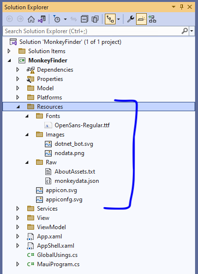

## القسم الأول - نظرة عامة

لنبدأ بالحصول على نظرة عامة أساسية على .NET MAUI وكيفية هيكلة المشاريع.

هذه الوحدة متاحة أيضًا باللغتين [الصينية (المبسطة)](README.zh-cn.md) و[الصينية (التقليدية)](README.zh-tw.md).

### افتح الحل في Visual Studio

1. افتح **الجزء 1 - عرض البيانات/MonkeyFinder.sln**

يحتوي MonkeyFinder هذا على مشروع واحد:

* MonkeyFinder - مشروع .NET MAUI الرئيسي الذي يستهدف Android وiOS وmacOS وWindows. وهو يتضمن جميع الهياكل الداعمة للتطبيق بما في ذلك النماذج والعروض ونماذج العرض والخدمات.


يحتوي مشروع **MonkeyFinder** أيضًا على ملفات كود فارغة وصفحات XAML سنستخدمها أثناء ورشة العمل. ستكون جميع التعليمات البرمجية التي نقوم بتعديلها في هذا المشروع للورشة.

### فهم مشروع .NET MAUI الفردي

يأخذ مشروع .NET متعدد المنصات (.NET MAUI) الفردي تجارب التطوير الخاصة بالمنصة التي تواجهها عادةً أثناء تطوير التطبيقات ويلخصها في مشروع مشترك واحد يمكنه استهداف Android وiOS وmacOS وWindows.

يوفر مشروع .NET MAUI الفردي تجربة تطوير مبسطة ومتسقة عبر الأنظمة الأساسية، بغض النظر عن الأنظمة الأساسية المستهدفة. يوفر مشروع .NET MAUI الفردي الميزات التالية:

- مشروع مشترك واحد يمكنه استهداف Android وiOS وmacOS وWindows.
- تحديد هدف تصحيح مبسط لتشغيل تطبيقات .NET MAUI الخاصة بك.
- ملفات موارد مشتركة داخل المشروع الفردي.
- الوصول إلى واجهات برمجة التطبيقات والأدوات الخاصة بالمنصة عند الحاجة.
- نقطة دخول تطبيق عبر الأنظمة الأساسية.

يتم تمكين مشروع واحد في .NET MAUI باستخدام الاستهداف المتعدد واستخدام مشاريع على غرار SDK في .NET 6.

#### ملفات الموارد

كانت إدارة الموارد لتطوير التطبيقات عبر الأنظمة الأساسية مشكلة بشكل تقليدي. فلكل منصة نهجها الخاص لإدارة الموارد، والذي يجب تنفيذه على كل منصة. على سبيل المثال، لكل منصة متطلبات مختلفة للصور تتضمن عادةً إنشاء إصدارات متعددة لكل صورة بدقة مختلفة. لذلك، عادةً ما يتعين تكرار صورة واحدة عدة مرات لكل منصة بدقة مختلفة، مع ضرورة استخدام الصور الناتجة لاتفاقيات مختلفة لأسماء الملفات والمجلدات على كل منصة.

يتيح مشروع واحد في .NET MAUI تخزين ملفات الموارد في مكان واحد أثناء استخدامها على كل منصة. ويشمل ذلك الخطوط والصور وأيقونة التطبيق وشاشة البداية والأصول الخام.

> هام:
> يتم استخدام كل ملف مورد صورة كصورة مصدر، والتي يتم من خلالها إنشاء صور بالدقة المطلوبة لكل منصة في وقت البناء.

يجب وضع ملفات الموارد في مجلد _Resources_ الخاص بمشروع تطبيق .NET MAUI الخاص بك، أو المجلدات الفرعية لمجلد _Resources_، ويجب تعيين إجراء البناء الخاص بها بشكل صحيح. يوضح الجدول التالي إجراءات البناء لكل نوع من أنواع ملفات الموارد:

| Resource | إجراء البناء |
| -------- | ------------ |
| App icon | MauiIcon |
| Fonts | MauiFont |
| Images | MauiImage |
| Splash screen | MauiSplashScreen |
| Raw assets | MauiAsset |

<!--| CSS files | MauiCss | -->

> ملاحظة:
> يتم تخزين ملفات XAML أيضًا في مشروع تطبيق .NET MAUI الخاص بك، ويتم تعيين إجراء البناء **MauiXaml** تلقائيًا عند إنشائها بواسطة قوالب المشروع والعناصر. ومع ذلك، لن توجد ملفات XAML عادةً في مجلد _Resources_ الخاص بمشروع التطبيق.

عند إضافة ملف مورد إلى مشروع تطبيق .NET MAUI، يتم إنشاء إدخال مطابق للمورد في ملف المشروع (.csproj). بعد إضافة ملف مورد، يمكن ضبط إجراء البناء الخاص به في نافذة **الخصائص**. تُظهر لقطة الشاشة التالية مجلدًا _Resources_ يحتوي على موارد الصور والخطوط في مجلدات فرعية:



يمكن تعيين المجلدات الفرعية لمجلد _Resources_ لكل نوع من الموارد عن طريق تحرير ملف المشروع الخاص بتطبيقك:

```xml
<ItemGroup>
<!-- Images -->
<MauiImage Include="Resources\Images\*" />

<!-- Fonts -->
<MauiFont Include="Resources\Fonts\*" />

<!-- Raw Assets (also remove the "Resources\Raw" prefix) -->
<MauiAsset Include="Resources\Raw\**" LogicalName="%(RecursiveDir)%(Filename)%(Extension)" />
</ItemGroup>
```

الحرف البديل (`*`) يشير إلى أن جميع الملفات الموجودة داخل المجلد سيتم التعامل معها على أنها من نوع الموارد المحدد. بالإضافة إلى ذلك، من الممكن تضمين جميع الملفات من المجلدات الفرعية:

```xml
<ItemGroup>
<!-- Images -->
<MauiImage Include="Resources\Images\**\*" />
</ItemGroup>
```

في هذا المثال، يحدد الحرف البديل المزدوج ('**') أن المجلد _Images_ يمكن أن يحتوي على مجلدات فرعية. لذلك، يحدد `<MauiImage Include="Resources\Images\**\*" />` أن أي ملفات في المجلد _Resources\Images_، أو أي مجلدات فرعية لمجلد _Images_، سيتم استخدامها كصور مصدر يتم من خلالها إنشاء صور بالدقة المطلوبة لكل منصة.

### أيقونات التطبيق

يمكن إضافة أيقونة تطبيق إلى مشروع التطبيق الخاص بك عن طريق سحب صورة إلى مجلد _Resources\Images_ الخاص بالمشروع، وتعيين إجراء بناء الأيقونة إلى **MauiIcon** في نافذة **Properties**. يؤدي هذا إلى إنشاء إدخال مماثل في ملف المشروع الخاص بك:

```xml
<MauiIcon Include="Resources\Images\appicon.png" />
```

أثناء وقت البناء، يتم تغيير حجم أيقونة التطبيق إلى الأحجام الصحيحة للمنصة والجهاز المستهدفين. ثم تتم إضافة أيقونات التطبيق التي تم تغيير حجمها إلى حزمة التطبيق الخاصة بك. يتم تغيير حجم أيقونات التطبيق إلى دقة متعددة لأن لها استخدامات متعددة، بما في ذلك استخدامها لتمثيل التطبيق على الجهاز وفي متجر التطبيقات.

#### الصور

يمكن إضافة الصور إلى مشروع التطبيق الخاص بك عن طريق سحبها إلى مجلد _Resources\Images_ الخاص بمشروعك، وتعيين إجراء بنائها إلى **MauiImage** في نافذة **Properties**. يؤدي هذا إلى إنشاء إدخال مماثل لكل صورة في ملف المشروع الخاص بك:

```xml
<MauiImage Include="Resources\Images\logo.jpg" />
```

أثناء وقت البناء، يتم تغيير حجم الصور إلى الدقة الصحيحة للمنصة والجهاز المستهدفين. ثم تتم إضافة الصور التي تم تغيير حجمها إلى حزمة التطبيق الخاصة بك.

#### الخطوط

يمكن إضافة خطوط True Type (TTF) وOpen Type (OTF) إلى مشروع التطبيق الخاص بك عن طريق سحبها إلى مجلد _Resources\Fonts_ في مشروعك، وتعيين إجراء البناء الخاص بها إلى **MauiFont** في نافذة **Properties**. يؤدي هذا إلى إنشاء إدخال مماثل لكل خط في ملف المشروع الخاص بك:

```xml
<MauiFont Include="Resources\Fonts\OpenSans-Regular.ttf" />
```

أثناء وقت البناء، يتم نسخ الخطوط إلى حزمة التطبيق الخاصة بك.

<!-- لمزيد من المعلومات، راجع [الخطوط](~/user-interface/fonts.md). -->

#### شاشة البداية

يمكن إضافة شاشة مائلة إلى مشروع التطبيق الخاص بك عن طريق سحب صورة إلى مجلد _Resources\Images_ في مشروعك، وتعيين إجراء بناء الصورة إلى **MauiSplashScreen** في نافذة **الخصائص**. يؤدي هذا إلى إنشاء إدخال مماثل في ملف المشروع الخاص بك:

```xml
<MauiSplashScreen Include="Resources\Images\splashscreen.svg" />
```

أثناء وقت البناء، يتم تغيير حجم صورة شاشة البداية إلى الحجم الصحيح للمنصة والجهاز المستهدفين. ثم تتم إضافة شاشة البداية التي تم تغيير حجمها إلى حزمة التطبيق الخاصة بك.

#### الأصول الخام

يمكن إضافة ملفات الأصول الخام، مثل HTML وJSON ومقاطع الفيديو، إلى مشروع التطبيق الخاص بك عن طريق سحبها إلى مجلد _Resources_ في مشروعك (أو مجلد فرعي، مثل _Resources\Assets_)، وتعيين إجراء البناء الخاص بها إلى `MauiAsset` في نافذة **الخصائص**. يؤدي هذا إلى إنشاء إدخال مطابق لكل أصل في ملف المشروع الخاص بك:

```xml
<MauiAsset Include="Resources\Assets\index.html" />
```

يمكن بعد ذلك استهلاك الأصول الخام بواسطة عناصر التحكم، حسب الحاجة:

```xaml
<WebView Source="index.html" />
```

في وقت البناء، يتم نسخ الأصول الخام إلى حزمة التطبيق الخاصة بك.

### فهم بدء تشغيل تطبيق .NET MAUI

يتم تشغيل تطبيقات واجهة مستخدم التطبيقات متعددة المنصات .NET (.NET MAUI) باستخدام نموذج المضيف العام .NET. يتيح هذا تهيئة التطبيقات من موقع واحد، ويوفر القدرة على تكوين الخطوط والخدمات ومكتبات الجهات الخارجية.

تستدعي كل نقطة دخول منصة طريقة `CreateMauiApp` على فئة `MauiProgram` الثابتة التي تنشئ وتعيد `MauiApp`، وهي نقطة الدخول لتطبيقك.

يجب أن توفر فئة `MauiProgram` على الأقل تطبيقًا لتشغيله:

```csharp
namespace MyMauiApp;

public static class MauiProgram
{
public static MauiApp CreateMauiApp()
{
var builder = MauiApp.CreateBuilder();
builder
.UseMauiApp<App>();

return builder.Build();
}
}
```

تشتق فئة `App` من فئة `Application`:

```csharp
namespace MyMauiApp;

public class App : Application
{
public App()
{
InitializeComponent();

MainPage = new AppShell();
}
}
```

#### تسجيل الخطوط

يمكن إضافة الخطوط إلى تطبيقك والإشارة إليها باسم الملف أو الاسم المستعار. ويتم ذلك عن طريق استدعاء طريقة `ConfigureFonts` على الكائن `MauiAppBuilder`. ثم، على الكائن `IFontCollection`، استدع طريقة `AddFont` لإضافة الخط المطلوب:

```csharp

namespace MyMauiApp;

public static class MauiProgram
{
public static MauiApp CreateMauiApp()
{
var builder = MauiApp.CreateBuilder();
builder
.UseMauiApp<App>()
.ConfigureFonts(fonts =>
{
fonts.AddFont("OpenSans-Regular.ttf", "OpenSansRegular");
});

return builder.Build();
}
}
```

في المثال أعلاه، الوسيطة الأولى لطريقة `AddFont` هي اسم ملف الخط، بينما تمثل الوسيطة الثانية اسمًا مستعارًا اختياريًا يمكن الرجوع إليه عند استخدام الخط.

يجب تضمين أي خطوط مخصصة يستخدمها التطبيق في ملف .csproj الخاص بك. يمكن إنجاز ذلك من خلال الإشارة إلى أسماء الملفات الخاصة بها، أو باستخدام حرف بدل:

```xml
<ItemGroup>
<MauiFont Include="Resources\Fonts\*" />
</ItemGroup>
```

> ملاحظة:
> سيتم تضمين الخطوط المضافة إلى المشروع من خلال مستكشف الحلول في Visual Studio تلقائيًا في ملف .csproj.

يمكن بعد ذلك استخدام الخط من خلال الإشارة إلى اسمه، دون امتداد الملف:

```xaml
<!-- Use font name -->
<Label Text="Hello .NET MAUI"
FontFamily="OpenSans-Regular" />
```

بدلاً من ذلك، يمكن استخدامه من خلال الإشارة إلى اسمه المستعار:

```xaml
<!-- Use font alias -->
<Label Text="Hello .NET MAUI"
FontFamily="OpenSansRegular" />
```

الآن بعد أن أصبح لديك فهم أساسي لمشروع .NET MAUI، فلنبدأ في إنشاء تطبيق! انتقل إلى [الجزء 1](../Part%201%20-%20Displaying%20Data/README.md).