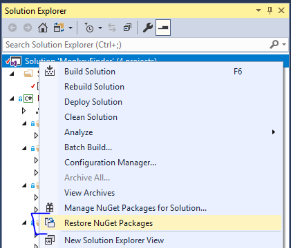
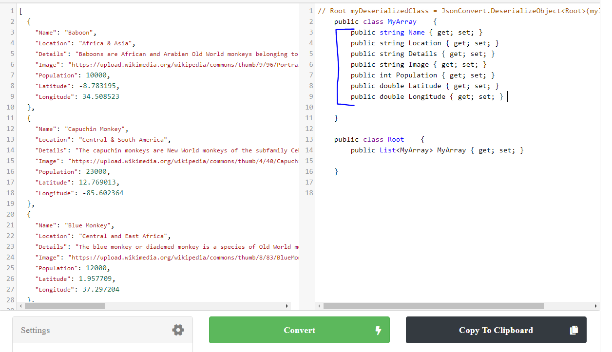
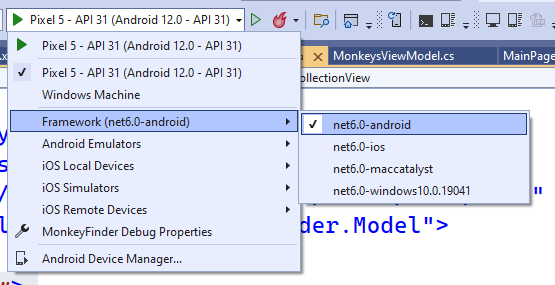

## عرض البيانات

في الجزء 0، حصلت على فهم أساسي لما يشكل مشروع .NET MAUI، والآن دعنا نبدأ في الترميز ونرى كيفية عرض قائمة من البيانات في قائمة.

هذه الوحدة متاحة أيضًا باللغتين [الصينية (المبسطة)](README.zh-cn.md) و[الصينية (التقليدية)](README.zh-tw.md).

### افتح الحل في Visual Studio

1. افتح **الجزء 1 - عرض البيانات/MonkeyFinder.sln**

يحتوي MonkeyFinder هذا على مشروع واحد:

* MonkeyFinder - مشروع .NET MAUI الرئيسي الذي يستهدف Android وiOS وmacOS وWindows. وهو يتضمن جميع الهياكل الداعمة للتطبيق بما في ذلك النماذج والعروض ونماذج العرض والخدمات.


يحتوي مشروع **MonkeyFinder** أيضًا على ملفات أكواد فارغة وصفحات XAML سنستخدمها أثناء ورشة العمل. ستكون جميع الأكواد التي سنعدلها موجودة في هذا المشروع للورشة.

### استعادة NuGet

جميع المشاريع لديها حزم NuGet المطلوبة مثبتة بالفعل، لذا لن تكون هناك حاجة لتثبيت حزم إضافية أثناء المختبر العملي. أول شيء يجب علينا فعله هو استعادة جميع حزم NuGet من الإنترنت.

1. **انقر بزر الماوس الأيمن** على **الحل** وحدد **استعادة حزم NuGet...**



### النموذج

سنقوم بتنزيل التفاصيل حول القرد وسنحتاج إلى فئة لتمثيله.



يمكننا بسهولة تحويل ملف json الموجود على [montemagno.com/monkeys.json](https://montemagno.com/monkeys.json) باستخدام [json2csharp.com](https://json2csharp.com) ولصق ملف json الخام في quicktype لتوليد فئات C#. تأكد من تعيين الاسم على `Monkey` ومساحة الاسم المولدة على `MonkeyFinder.Model` وحدد C#.

1. افتح `Model/Monkey.cs`
2. في `Monkey.cs`، انسخ/الصق الخصائص:
```csharp
public class Monkey
{        
    public string Name { get; set; } 
    public string Location { get; set; } 
    public string Details { get; set; } 
    public string Image { get; set; } 
    public int Population { get; set; } 
    public double Latitude { get; set; } 
    public double Longitude { get; set; } 
}
```

بالإضافة إلى ذلك، نظرًا لأننا سنستخدم `System.Text.Json` لإلغاء تسلسل البيانات، فسنرغب في إضافة `MonkeyContext` الذي سيعمل على إنشاء التعليمات البرمجية ديناميكيًا لتحسين الأداء. سيعمل التعليمات البرمجية التالية على تمكين ذلك وسنستخدمها في المستقبل.

```csharp
[JsonSerializable(typeof(List<Monkey>))]
internal sealed partial class MonkeyContext : JsonSerializerContext
{

}
```

### عرض البيانات

يمكننا عرض البيانات المبرمجة من أي نوع بيانات في `CollectionView` في `MainPage.xaml`. سيسمح لنا هذا ببناء واجهة المستخدم الخاصة بنا من خلال تعيين `ItemTemplate` ببعض الصور والعلامات البسيطة.

نحتاج أولاً إلى إضافة مساحة اسم جديدة في الجزء العلوي من `MainPage.xaml`:


```xml
xmlns:model="clr-namespace:MonkeyFinder.Model"
```

سيسمح لنا هذا بالرجوع إلى فئة Monkey أعلاه لأغراض ربط البيانات.

أضف ما يلي إلى `ContentPage` في MainPage.xaml:

```xml
<CollectionView>
    <CollectionView.ItemsSource>
        <x:Array Type="{x:Type model:Monkey}">
            <model:Monkey
                Name="Baboon"
                Image="https://raw.githubusercontent.com/jamesmontemagno/app-monkeys/master/baboon.jpg"
                Location="Africa and Asia" />
            <model:Monkey
                Name="Capuchin Monkey"
                Image="https://raw.githubusercontent.com/jamesmontemagno/app-monkeys/master/capuchin.jpg"
                Location="Central and South America" />
            <model:Monkey
                Name="Red-shanked douc"
                Image="https://raw.githubusercontent.com/jamesmontemagno/app-monkeys/master/douc.jpg"
                Location="Vietnam" />
        </x:Array>
    </CollectionView.ItemsSource>
    <CollectionView.ItemTemplate>
        <DataTemplate x:DataType="model:Monkey">
            <HorizontalStackLayout Padding="10">
                <Image
                    Aspect="AspectFill"
                    HeightRequest="100"
                    Source="{Binding Image}"
                    WidthRequest="100" />
                <Label VerticalOptions="Center" TextColor="Gray">
                    <Label.Text>
                        <MultiBinding StringFormat="{}{0} | {1}">
                            <Binding Path="Name" />
                            <Binding Path="Location" />
                        </MultiBinding>
                    </Label.Text>
                </Label>
            </HorizontalStackLayout>
        </DataTemplate>
    </CollectionView.ItemTemplate>
</CollectionView>
```


إذا أردنا عرض السلسلتين عموديًا فوق بعضهما البعض، فيمكننا وضع عنصري تحكم `Label` داخل `VerticalStackLayout` وتعيين أحجام الخطوط لتبرز:


```xml
 <HorizontalStackLayout Padding="10">
    <Image
        Aspect="AspectFill"
        HeightRequest="100"
        Source="{Binding Image}"
        WidthRequest="100" />
    <VerticalStackLayout VerticalOptions="Center">
        <Label Text="{Binding Name}" FontSize="24" TextColor="Gray"/>
        <Label Text="{Binding Location}" FontSize="18" TextColor="Gray"/>
    </VerticalStackLayout>
</HorizontalStackLayout>
```


### قم بتشغيل التطبيق

تأكد من إعداد جهازك للنشر وتصحيح الأخطاء على المنصات المختلفة:

* [Android Emulator Setup](https://docs.microsoft.com/dotnet/maui/android/emulator/device-manager)
* [Windows setup for development](https://docs.microsoft.com/dotnet/maui/windows/setup)

1. في Visual Studio، قم بتعيين تطبيق Android أو Windows كمشروع بدء التشغيل من خلال تحديد القائمة المنسدلة في قائمة التصحيح وتغيير "Framework"



2. في Visual Studio، انقر فوق الزر "تصحيح" أو "أدوات" -> بدء التصحيح
- إذا كنت تواجه أي مشكلة، فراجع أدلة الإعداد لمنصة التشغيل الخاصة بك

سيؤدي تشغيل التطبيق إلى ظهور قائمة بثلاثة قرود:


لنستمر ونتعلم كيفية استخدام نمط MVVM مع ربط البيانات في [الجزء 2](../Part%202%20-%20MVVM/README.md)