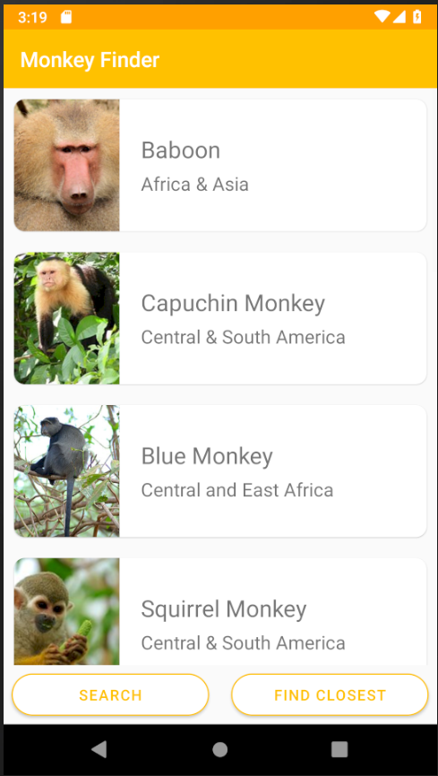

## MVVM وربط البيانات

في الجزء الثاني، سنقدم ربط البيانات الكامل باستخدام MVVM ونسترد القرود من مصدر بيانات الإنترنت.

تتوفر هذه الوحدة أيضًا باللغتين [الصينية (المبسطة)](README.zh-cn.md) و[الصينية (التقليدية)](README.zh-tw.md).

### تنفيذ INotifyPropertyChanged

*INotifyPropertyChanged* مهم لربط البيانات في أطر عمل MVVM. هذه واجهة تتيح لعرضنا عند تنفيذها معرفة التغييرات التي تطرأ على النموذج. سننفذها مرة واحدة في `BaseViewModel` الخاص بنا حتى تتمكن جميع نماذج العرض الأخرى التي ننشئها من الوراثة منها.

1. في Visual Studio، افتح `ViewModel/BaseViewModel.cs`
2. في `BaseViewModel.cs`، قم بتنفيذ INotifyPropertyChanged عن طريق تغيير هذا

```csharp
public class BaseViewModel
{

}
```

لهذا

```csharp
public class BaseViewModel : INotifyPropertyChanged
{

}
```

3. في `BaseViewModel.cs`، انقر بزر الماوس الأيمن على `INotifyPropertyChanged`
4. قم بتنفيذ واجهة `INotifyPropertyChanged`
- (Visual Studio Mac) في قائمة النقر بزر الماوس الأيمن، حدد Quick Fix -> Implement Interface
- (Visual Studio PC) في قائمة النقر بزر الماوس الأيمن، حدد Quick Actions and Refactorings -> Implement Interface
5. في `BaseViewModel.cs`، تأكد من ظهور سطر التعليمات البرمجية التالي الآن:

```csharp
public event PropertyChangedEventHandler PropertyChanged;
```

6. في `BaseViewModel.cs`، قم بإنشاء طريقة جديدة تسمى `OnPropertyChanged`
- ملاحظة: سوف نستدعي `OnPropertyChanged` كلما تم تحديث خاصية

```csharp
public void OnPropertyChanged([CallerMemberName] string name = null) =>
    PropertyChanged?.Invoke(this, new PropertyChangedEventArgs(name));
```

### تنفيذ Title وIsBusy وIsNotBusy

سنقوم بإنشاء حقل دعم وعوامل وصول لبعض الخصائص. ستسمح لنا هذه الخصائص بتعيين العنوان على صفحاتنا كما ستسمح لنموذج العرض الخاص بنا بمعرفة أن نموذج العرض الخاص بنا مشغول حتى لا ننفذ عمليات مكررة (مثل السماح للمستخدم بتحديث البيانات عدة مرات). توجد هذه الخصائص في `BaseViewModel` لأنها مشتركة لكل صفحة.

1. في `BaseViewModel.cs`، قم بإنشاء حقل الدعم:

```csharp
public class BaseViewModel : INotifyPropertyChanged
{
    bool isBusy;
    string title;
    //...
}
```

2. إنشاء الخصائص:

```csharp
public class BaseViewModel : INotifyPropertyChanged
{
    //...
    public bool IsBusy
    {
        get => isBusy;
        set
        {
            if (isBusy == value)
                return;
            isBusy = value;
            OnPropertyChanged();
        }
    }

    public string Title
    {
        get => title;
        set
        {
            if (title == value)
                return;
            title = value;
            OnPropertyChanged();
        }
    }
    //...
}
```

لاحظ أننا نستدعي `OnPropertyChanged` عندما تتغير القيمة. ستشترك البنية الأساسية لربط .NET MAUI في حدث **PropertyChanged** الخاص بنا حتى يتم إخطار واجهة المستخدم بالتغيير.

يمكننا أيضًا إنشاء عكس `IsBusy` عن طريق إنشاء خاصية أخرى تسمى `IsNotBusy` والتي تعيد عكس `IsBusy` ثم إثارة حدث `OnPropertyChanged` عندما نضبط `IsBusy`

```csharp
public class BaseViewModel : INotifyPropertyChanged
{
    //...
    public bool IsBusy
    {
        get => isBusy;
        set
        {
            if (isBusy == value)
                return;
            isBusy = value;
            OnPropertyChanged();
            // Also raise the IsNotBusy property changed
            OnPropertyChanged(nameof(IsNotBusy));
        }
    } 

    public bool IsNotBusy => !IsBusy;
    //...
}
```


### تبسيط MVVM باستخدام .NET Community Toolkit

الآن بعد أن أصبحت لديك فكرة عن كيفية عمل MVVM، دعنا نلقي نظرة على طريقة لتبسيط التطوير. مع تزايد تعقيد التطبيقات، سيتم إضافة المزيد من الخصائص والأحداث. وهذا يؤدي إلى إضافة المزيد من التعليمات البرمجية الجاهزة. تسعى .NET Community Toolkit إلى تبسيط MVVM باستخدام مولدات المصدر للتعامل تلقائيًا مع التعليمات البرمجية التي اعتدنا على كتابتها يدويًا. تمت إضافة مكتبة `CommunityToolkit.Mvvm` إلى المشروع ويمكننا البدء في استخدامها على الفور.

احذف جميع المحتويات الموجودة في `BaseViewModel.cs` واستبدلها بما يلي:

```csharp
namespace MonkeyFinder.ViewModel;

public partial class BaseViewModel : ObservableObject
{
    [ObservableProperty]
    [NotifyPropertyChangedFor(nameof(IsNotBusy))]
    bool isBusy;

    [ObservableProperty]
    string title;

    public bool IsNotBusy => !IsBusy;
}
```

هنا، يمكننا أن نرى أن الكود الخاص بنا تم تبسيطه بشكل كبير باستخدام فئة أساسية `ObservableObject` تنفذ `INotifyPropertyChanged` وتضيف أيضًا سمات لعرض خصائصنا.

لاحظ أن كلًا من isBusy وtitle يحتويان على سمة `[ObservableProperty]` مرفقة بهما. يبدو الكود الناتج متطابقًا تقريبًا مع ما كتبناه يدويًا. بالإضافة إلى ذلك، تحتوي خاصية isBusy على `[NotifyPropertyChangedFor(nameof(IsNotBusy))]`، والتي ستُعلم أيضًا `IsNotBusy` عندما تتغير القيمة. لرؤية الكود الناتج، توجه إلى المشروع ثم قم بتوسيع **Dependencies -> net8.0-android -> Analyzers -> CommunityToolkit.Mvvm.SourceGenerators -> CommunityToolkit.Mvvm.SourceGenerators.ObservablePropertyGenerator** وافتح `MonkeyFinder.ViewModel.BaseViewModel.cs`:

هذا هو شكل `IsBusy` الخاص بنا:

```csharp
[global::System.CodeDom.Compiler.GeneratedCode("CommunityToolkit.Mvvm.SourceGenerators.ObservablePropertyGenerator", "8.0.0.0")]
[global::System.Diagnostics.DebuggerNonUserCode]
[global::System.Diagnostics.CodeAnalysis.ExcludeFromCodeCoverage]
public bool IsBusy
{
    get => isBusy;
    set
    {
        if (!global::System.Collections.Generic.EqualityComparer<bool>.Default.Equals(isBusy, value))
        {
            OnPropertyChanging(global::CommunityToolkit.Mvvm.ComponentModel.__Internals.__KnownINotifyPropertyChangingArgs.IsBusy);
            isBusy = value;
            OnPropertyChanged(global::CommunityToolkit.Mvvm.ComponentModel.__Internals.__KnownINotifyPropertyChangedArgs.IsBusy);
            OnPropertyChanged(global::CommunityToolkit.Mvvm.ComponentModel.__Internals.__KnownINotifyPropertyChangedArgs.IsNotBusy);
        }
    }
}
```

قد يبدو هذا الكود مخيفًا بعض الشيء، ولكن نظرًا لأنه يتم إنشاؤه تلقائيًا، فإنه يضيف سمات إضافية لتجنب التعارضات. كما أنه مُحسَّن بدرجة كبيرة باستخدام التخزين المؤقت أيضًا.

ستساعدنا نفس المكتبة أيضًا في التعامل مع أحداث النقر المعروفة باسم "الأوامر" في المستقبل.

> لاحظ أننا غيرنا هذه الفئة إلى فئة "جزئية" حتى يمكن مشاركة الكود الناتج في الفئة.

### إنشاء خدمة Monkey

نحن مستعدون لإنشاء طريقة لاسترجاع بيانات القرد من الإنترنت. سنقوم أولاً بتنفيذ ذلك من خلال طلب HTTP بسيط باستخدام HttpClient. سنفعل ذلك داخل ملف "MonkeyService.cs" الموجود في مجلد "Services".

1. داخل "MonkeyService.cs"، دعنا نضيف طريقة جديدة للحصول على جميع القرود:

    ```csharp
    List<Monkey> monkeyList = new ();
    public async Task<List<Monkey>> GetMonkeys()
    {
        return monkeyList;
    }
    ```

    في الوقت الحالي، تقوم الطريقة ببساطة بإنشاء قائمة جديدة من القرود وإرجاعها. يمكننا الآن ملء الطريقة باستخدام `HttpClient` لسحب ملف json وتحليله وتخزينه مؤقتًا وإرجاعه.

1. دعنا نحصل على إمكانية الوصول إلى `HttpClient` عن طريق إضافته إلى المُنشئ لـ `MonkeyService`.

    ```csharp
     HttpClient httpClient;
    public MonkeyService()
    {
        this.httpClient = new HttpClient();
    }
    ```

   يتضمن .NET MAUI حقن التبعيات بشكل مشابه لـ ASP.NET Core. سنقوم بتسجيل هذه الخدمة والتبعيات قريبًا.

1. دعنا نتحقق لمعرفة ما إذا كان لدينا أي قرود في القائمة ونعيدها إذا كان الأمر كذلك عن طريق ملء طريقة `GetMonkeys`:

    ```csharp
    if (monkeyList?.Count > 0)
        return monkeyList;
    ```

1. يمكننا استخدام `HttpClient` لإنشاء طلب ويب وتحليله باستخدام التسلسل المدمج `System.Text.Json`.

    ```csharp
    var response = await httpClient.GetAsync("https://www.montemagno.com/monkeys.json");

    if (response.IsSuccessStatusCode)
    {
        monkeyList = await response.Content.ReadFromJsonAsync(MonkeyContext.Default.ListMonkey);
    }
    
    return monkeyList;
    ```

1. أضف التوجيه التالي باستخدام في أعلى الملف للوصول إلى طريقة الامتداد `ReadFromJsonAsync`:

    ```csharp
    using System.Net.Http.Json;
    ```

#### لا يوجد إنترنت؟ لا توجد مشكلة!

إذا كانت لديك مشكلات في الإنترنت في الإعداد الحالي، فلا تقلق لأننا قمنا بتضمين قائمة بالقرود في المشروع. بدلاً من استخدام `HttpClient`، يمكنك قراءة الملف وإعادته:

```csharp
using var stream = await FileSystem.OpenAppPackageFileAsync("monkeydata.json");
using var reader = new StreamReader(stream);
var contents = await reader.ReadToEndAsync();
monkeyList = JsonSerializer.Deserialize(contents, MonkeyContext.Default.ListMonkey);
```


### استدعاء MonkeyService من ViewModel

يمكننا الآن تحديث `MonkeysViewModel` لاستدعاء خدمة القرود الجديدة لدينا وعرض قائمة القرود على واجهة المستخدم الخاصة بنا.

سنستخدم `ObservableCollection<Monkey>` التي سيتم مسحها ثم تحميلها بأشياء **Monkey**. نستخدم `ObservableCollection` لأنها تحتوي على دعم مدمج لرفع أحداث `CollectionChanged` عند إضافة أو إزالة عناصر من المجموعة. وهذا يعني أننا لا نستدعي `OnPropertyChanged` عند تحديث المجموعة.

1. في `MonkeysViewModel.cs` أعلن عن خاصية سنقوم بتهيئتها لمجموعة فارغة. أيضًا، يمكننا تعيين عنواننا إلى `Monkey Finder`.

    ```csharp
    public partial class MonkeysViewModel : BaseViewModel
    {
        public ObservableCollection<Monkey> Monkeys { get; } = new();
        public MonkeysViewModel()
        {
            Title = "Monkey Finder";
        }
    }
    ```
    
1. سنرغب في الوصول إلى خدمة `MonkeyService` الجديدة. لذا فلنضف الأمر التالي باستخدام في أعلى الملف:

```csharp
using MonkeyFinder.Services;
```

1. نحتاج أيضًا إلى الوصول إلى `MonkeyService` الخاص بنا، والذي سنقوم بحقنه من خلال المنشئ:
    ```csharp
    public ObservableCollection<Monkey> Monkeys { get; } = new();
    MonkeyService monkeyService;
    public MonkeysViewModel(MonkeyService monkeyService)
    {
        Title = "Monkey Finder";
        this.monkeyService = monkeyService;
    }
    ```

1. في `MonkeysViewModel.cs`، قم بإنشاء طريقة تسمى `GetMonkeysAsync` والتي ترجع `async Task`:

    ```csharp
    public class MonkeysViewModel : BaseViewModel
    {
        //...
        async Task GetMonkeysAsync()
        {
        }
        //...
    }
    ```

1. في `GetMonkeysAsync`، تأكد أولاً من أن `IsBusy` خاطئ. إذا كان صحيحًا، فارجع `return`

    ```csharp
    async Task GetMonkeysAsync()
    {
        if (IsBusy)
            return;
    }
    ```
1. في `GetMonkeysAsync`، أضف بعض الدعم لكتل ​​try/catch/finally
- لاحظ أننا نبدل *IsBusy* إلى true ثم إلى false عندما نبدأ في الاتصال بالخادم وعندما ننتهي.

    ```csharp
    async Task GetMonkeysAsync()
    {
        if (IsBusy)
            return;

        try
        {
            IsBusy = true;

        }
        catch (Exception ex)
        {

        }
        finally
        {
           IsBusy = false;
        }

    }
    ```

1. في كتلة `try` من `GetMonkeysAsync`، يمكننا الحصول على القرود من `MonkeyService` الخاصة بنا.

    ```csharp
    async Task GetMonkeysAsync()
    {
        //...
        try
        {
            IsBusy = true;

            var monkeys = await monkeyService.GetMonkeys();
        }
        //... 
    }
    ```

1. لا تزال داخل كتلة `try`، قم بمسح خاصية `Monkeys` ثم أضف بيانات القرد الجديدة:
    ```csharp
    async Task GetMonkeysAsync()
    {
        //...
        try
        {
            IsBusy = true;

            var monkeys = await monkeyService.GetMonkeys();

            if(Monkeys.Count != 0)
                Monkeys.Clear();

            foreach (var monkey in monkeys)
                Monkeys.Add(monkey);
        }
        //...
    }
    ```

1. في `GetMonkeysAsync`، أضف هذا الكود إلى كتلة `catch` لعرض نافذة منبثقة إذا فشل استرداد البيانات:

    ```csharp
    async Task GetMonkeysAsync()
    {
        //...
        catch(Exception ex)
        {
            Debug.WriteLine($"Unable to get monkeys: {ex.Message}");
            await Shell.Current.DisplayAlert("Error!", ex.Message, "OK");
        }
        //...
    }
    ```

1. تأكد من أن الكود المكتمل يبدو بهذا الشكل:

    ```csharp
    async Task GetMonkeysAsync()
    {
        if (IsBusy)
            return;

        try
        {
            IsBusy = true;
            var monkeys = await monkeyService.GetMonkeys();

            if(Monkeys.Count != 0)
                Monkeys.Clear();

            foreach(var monkey in monkeys)
                Monkeys.Add(monkey);

        }
        catch (Exception ex)
        {
            Debug.WriteLine($"Unable to get monkeys: {ex.Message}");
            await Shell.Current.DisplayAlert("Error!", ex.Message, "OK");
        }
        finally
        {
            IsBusy = false;
        }

    }
    ```

1. أخيرًا، دعنا نعرض هذه الطريقة عبر أمر "ICommand" الذي يمكننا ربط البيانات به. عادةً، يتعين علينا إنشاء حقل دعم مثل:

    ```csharp
    public Command GetMonkeysCommand { get; }
    public MonkeysViewModel()
    {
        //...
        GetMonkeysCommand = new Command(async () => await GetMonkeysAsync());
    }
    ```

ومع ذلك، باستخدام .NET Community Toolkit يمكننا ببساطة إضافة السمة `[RelayCommand]` إلى طريقتنا:

    ```csharp
     [RelayCommand]
    async Task GetMonkeysAsync()
    {
        //..
    }
    ```

    This will automatically create all of the code we need:

    ```csharp
	// <auto-generated/>

	namespace MonkeyFinder.ViewModel
	{
	    partial class MonkeysViewModel
	    {
		/// <summary>The backing field for <see cref="GetMonkeysASyncCommand"/>.</summary>
		[global::System.CodeDom.Compiler.GeneratedCode("CommunityToolkit.Mvvm.SourceGenerators.RelayCommandGenerator", "8.0.0.0")]
		private global::CommunityToolkit.Mvvm.Input.AsyncRelayCommand? getMonkeysASyncCommand;
		/// <summary>Gets an <see cref="global::CommunityToolkit.Mvvm.Input.IAsyncRelayCommand"/> instance wrapping <see cref="GetMonkeysASync"/>.</summary>
		[global::System.CodeDom.Compiler.GeneratedCode("CommunityToolkit.Mvvm.SourceGenerators.RelayCommandGenerator", "8.0.0.0")]
		[global::System.Diagnostics.CodeAnalysis.ExcludeFromCodeCoverage]
		public global::CommunityToolkit.Mvvm.Input.IAsyncRelayCommand GetMonkeysASyncCommand => getMonkeysASyncCommand ??= new global::CommunityToolkit.Mvvm.Input.AsyncRelayCommand(new global::System.Func<global::System.Threading.Tasks.Task>(GetMonkeysASync));
	    }
	}
    ```

سحر!

لقد اكتملت الآن طريقتنا الرئيسية للحصول على البيانات!

### تسجيل الخدمات

قبل أن نتمكن من تشغيل التطبيق، يجب علينا تسجيل جميع التبعيات الخاصة بنا. افتح ملف `MauiProgram.cs`.

1. أضف التوجيه التالي باستخدام للوصول إلى `MonkeyService` الخاص بنا:

	```csharp
	using MonkeyFinder.Services;
	```

1. ابحث عن المكان الذي نقوم فيه بتسجيل `MainPage` الخاص بنا مع `builder.Services` وأضف ما يلي فوقه:

	```csharp
	builder.Services.AddSingleton<MonkeyService>();
	builder.Services.AddSingleton<MonkeysViewModel>();
	```

نقوم بتسجيل `MonkeyService` و`MonkeysViewModel` كعناصر فردية. وهذا يعني أنه سيتم إنشاؤها مرة واحدة فقط، وإذا أردنا إنشاء مثيل فريد لكل طلب، فسوف نقوم بتسجيلهما كـ `Transient`.

1. في الكود الموجود خلف المشروع، سنقوم بحقن `MonkeysViewModel` في صفحتنا الرئيسية:

    ```csharp
    public MainPage(MonkeysViewModel viewModel)
    {
	InitializeComponent();
	BindingContext = viewModel;
    }
    ```

## إنشاء واجهة مستخدم Monkeys
حان الوقت الآن لإنشاء واجهة مستخدم .NET MAUI في `View/MainPage.xaml`. والنتيجة النهائية هي إنشاء صفحة تبدو بهذا الشكل:



1. في `MainPage.xaml`، أضف مساحة اسم `xmlns:viewmodel` و`x:DataType` في أعلى علامة `ContentPage`، مما سيمكننا من الحصول على intellisense ملزمة:

    ```xml
    <ContentPage
        xmlns="http://schemas.microsoft.com/dotnet/2021/maui"
        xmlns:x="http://schemas.microsoft.com/winfx/2009/xaml" 
        x:Class="MonkeyFinder.View.MainPage"
        xmlns:model="clr-namespace:MonkeyFinder.Model"
        xmlns:viewmodel="clr-namespace:MonkeyFinder.ViewModel"
        x:DataType="viewmodel:MonkeysViewModel">

    </ContentPage>
    ```

يُطلق على هذا اسم الربط المجمّع. نحدد أننا سنربط مباشرةً بـ `MonkeysViewModel`. سيؤدي هذا إلى التحقق من الأخطاء وتحسين الأداء.

1. يمكننا إنشاء أول ربط لنا على `ContentPage` عن طريق إضافة الخاصية `Title`:

```xml
<ContentPage
    xmlns="http://schemas.microsoft.com/dotnet/2021/maui"
    xmlns:x="http://schemas.microsoft.com/winfx/2009/xaml"
    x:Class="MonkeyFinder.View.MainPage"
    xmlns:model="clr-namespace:MonkeyFinder.Model"
    xmlns:viewmodel="clr-namespace:MonkeyFinder.ViewModel"
    x:DataType="viewmodel:MonkeysViewModel"
    Title="{Binding Title}">

</ContentPage>
```

1. في `MainPage.xaml`، يمكننا إضافة `Grid` بين علامتي `ContentPage` بصفين وعمودين. وسنقوم أيضًا بتعيين `RowSpacing` و`ColumnSpacing` إلى

```xml
<ContentPage
    xmlns="http://schemas.microsoft.com/dotnet/2021/maui"
    xmlns:x="http://schemas.microsoft.com/winfx/2009/xaml"
    x:Class="MonkeyFinder.View.MainPage"
    xmlns:model="clr-namespace:MonkeyFinder.Model"
    xmlns:viewmodel="clr-namespace:MonkeyFinder.ViewModel"
    x:DataType="viewmodel:MonkeysViewModel"
    Title="{Binding Title}">

    <!-- Add this -->
    <Grid
        ColumnDefinitions="*,*"
        ColumnSpacing="5"
        RowDefinitions="*,Auto"
        RowSpacing="0">
    </Grid>
</ContentPage>
```

1. في `MainPage.xaml`، يمكننا إضافة `CollectionView` بين علامتي `Grid` التي تمتد على عمودين. وسنقوم أيضًا بتعيين `ItemsSource` الذي سيرتبط بـ `Monkeys` ObservableCollection` بالإضافة إلى تعيين بعض الخصائص لتحسين القائمة.

```xml
<ContentPage
    xmlns="http://schemas.microsoft.com/dotnet/2021/maui"
    xmlns:x="http://schemas.microsoft.com/winfx/2009/xaml"
    x:Class="MonkeyFinder.View.MainPage"
    xmlns:model="clr-namespace:MonkeyFinder.Model"
    xmlns:viewmodel="clr-namespace:MonkeyFinder.ViewModel"
    x:DataType="viewmodel:MonkeysViewModel"
    Title="{Binding Title}">

    <!-- Add this -->
    <Grid
        ColumnDefinitions="*,*"
        ColumnSpacing="5"
        RowDefinitions="*,Auto"
        RowSpacing="0">
         <CollectionView ItemsSource="{Binding Monkeys}"
                         SelectionMode="None"
                         Grid.ColumnSpan="2">

        </CollectionView>
    </Grid>
</ContentPage>
```

1. في `MainPage.xaml`، يمكننا إضافة `ItemTemplate` إلى `CollectionView` الخاص بنا والذي سيمثل ما يعرضه كل عنصر في القائمة:

```xml
<ContentPage
    xmlns="http://schemas.microsoft.com/dotnet/2021/maui"
    xmlns:x="http://schemas.microsoft.com/winfx/2009/xaml"
    x:Class="MonkeyFinder.View.MainPage"
    xmlns:model="clr-namespace:MonkeyFinder.Model"
    xmlns:viewmodel="clr-namespace:MonkeyFinder.ViewModel"
    x:DataType="viewmodel:MonkeysViewModel"
    Title="{Binding Title}">

   <Grid
        ColumnDefinitions="*,*"
        ColumnSpacing="5"
        RowDefinitions="*,Auto"
        RowSpacing="0">
        <CollectionView ItemsSource="{Binding Monkeys}"
                         SelectionMode="None"
                         Grid.ColumnSpan="2">
            <CollectionView.ItemTemplate>
                <DataTemplate x:DataType="model:Monkey">
                    <Grid Padding="10">
                        <Frame HeightRequest="125" Style="{StaticResource CardView}">
                            <Grid Padding="0" ColumnDefinitions="125,*">
                                <Image Aspect="AspectFill" Source="{Binding Image}"
                                       WidthRequest="125"
                                       HeightRequest="125"/>
                                <VerticalStackLayout
                                    Grid.Column="1"
                                    VerticalOptions="Center"
                                    Padding="10">
                                    <Label Style="{StaticResource LargeLabel}" Text="{Binding Name}" />
                                    <Label Style="{StaticResource MediumLabel}" Text="{Binding Location}" />
                                </VerticalStackLayout>
                            </Grid>
                        </Frame>
                    </Grid>
                </DataTemplate>
            </CollectionView.ItemTemplate>
        </CollectionView>
    </Grid>
</ContentPage>
```

1. في `MainPage.xaml`، يمكننا إضافة `Button` أسفل `CollectionView` الخاص بنا والذي سيمكننا من النقر فوقه والحصول على القرود من الخادم:

```xml
<ContentPage
    xmlns="http://schemas.microsoft.com/dotnet/2021/maui"
    xmlns:x="http://schemas.microsoft.com/winfx/2009/xaml"
    x:Class="MonkeyFinder.View.MainPage"
    xmlns:model="clr-namespace:MonkeyFinder.Model"
    xmlns:viewmodel="clr-namespace:MonkeyFinder.ViewModel"
    x:DataType="viewmodel:MonkeysViewModel"
    Title="{Binding Title}">

   <Grid
        ColumnDefinitions="*,*"
        ColumnSpacing="5"
        RowDefinitions="*,Auto"
        RowSpacing="0">
        <CollectionView ItemsSource="{Binding Monkeys}"
                         SelectionMode="None"
                         Grid.ColumnSpan="2">
            <CollectionView.ItemTemplate>
                <DataTemplate x:DataType="model:Monkey">
                    <Grid Padding="10">
                        <Frame HeightRequest="125" Style="{StaticResource CardView}">
                            <Grid Padding="0" ColumnDefinitions="125,*">
                                <Image Aspect="AspectFill" Source="{Binding Image}"
                                       WidthRequest="125"
                                       HeightRequest="125"/>
                                <VerticalStackLayout
                                    Grid.Column="1"
                                    VerticalOptions="Center"
                                    Padding="10">
                                    <Label Style="{StaticResource LargeLabel}" Text="{Binding Name}" />
                                    <Label Style="{StaticResource MediumLabel}" Text="{Binding Location}" />
                                </VerticalStackLayout>
                            </Grid>
                        </Frame>
                    </Grid>
                </DataTemplate>
            </CollectionView.ItemTemplate>
        </CollectionView>

        <!-- Add this -->
        <Button Text="Get Monkeys" 
                Command="{Binding GetMonkeysCommand}"
                IsEnabled="{Binding IsNotBusy}"
                Grid.Row="1"
                Grid.Column="0"
                Style="{StaticResource ButtonOutline}"
                Margin="8"/>
    </Grid>
</ContentPage>
```


1. أخيرًا، في `MainPage.xaml`، يمكننا إضافة `ActivityIndicator` أعلى جميع عناصر التحكم لدينا في الجزء السفلي أو `Grid` الذي سيعرض مؤشرًا على حدوث شيء ما عندما نضغط على زر `Get Monkeys`.

```xml
<ContentPage
    xmlns="http://schemas.microsoft.com/dotnet/2021/maui"
    xmlns:x="http://schemas.microsoft.com/winfx/2009/xaml"
    x:Class="MonkeyFinder.View.MainPage"
    xmlns:model="clr-namespace:MonkeyFinder.Model"
    xmlns:viewmodel="clr-namespace:MonkeyFinder.ViewModel"
    x:DataType="viewmodel:MonkeysViewModel"
    Title="{Binding Title}">

   <Grid
        ColumnDefinitions="*,*"
        ColumnSpacing="5"
        RowDefinitions="*,Auto"
        RowSpacing="0">
        <CollectionView ItemsSource="{Binding Monkeys}"
                         SelectionMode="None"
                         Grid.ColumnSpan="2">
            <CollectionView.ItemTemplate>
                <DataTemplate x:DataType="model:Monkey">
                    <Grid Padding="10">
                        <Frame HeightRequest="125" Style="{StaticResource CardView}">
                            <Grid Padding="0" ColumnDefinitions="125,*">
                                <Image Aspect="AspectFill" Source="{Binding Image}"
                                       WidthRequest="125"
                                       HeightRequest="125"/>
                                <VerticalStackLayout
                                    Grid.Column="1"
                                    VerticalOptions="Center"
                                    Padding="10">
                                    <Label Style="{StaticResource LargeLabel}" Text="{Binding Name}" />
                                    <Label Style="{StaticResource MediumLabel}" Text="{Binding Location}" />
                                </VerticalStackLayout>
                            </Grid>
                        </Frame>
                    </Grid>
                </DataTemplate>
            </CollectionView.ItemTemplate>
        </CollectionView>

        <Button Text="Get Monkeys" 
                Command="{Binding GetMonkeysCommand}"
                IsEnabled="{Binding IsNotBusy}"
                Grid.Row="1"
                Grid.Column="0"
                Style="{StaticResource ButtonOutline}"
                Margin="8"/>

        <!-- Add this -->
        <ActivityIndicator IsVisible="{Binding IsBusy}"
                           IsRunning="{Binding IsBusy}"
                           HorizontalOptions="Fill"
                           VerticalOptions="Center"
			   Color="{StaticResource Primary}"
                           Grid.RowSpan="2"
                           Grid.ColumnSpan="2"/>
    </Grid>
</ContentPage>
```

### قم بتشغيل التطبيق

1. في Visual Studio، قم بتعيين مشروع iOS أو Android أو macOS أو Windows كمشروع بدء التشغيل

2. في Visual Studio، انقر فوق "بدء التصحيح". عند بدء تشغيل التطبيق، سترى زر **Get Monkeys** الذي عند الضغط عليه سيقوم بتحميل بيانات القرود من الإنترنت!

لنواصل رحلتنا ونتعلم عن التنقل في [الجزء 3](../Part%203%20-%20Navigation/README.md)
