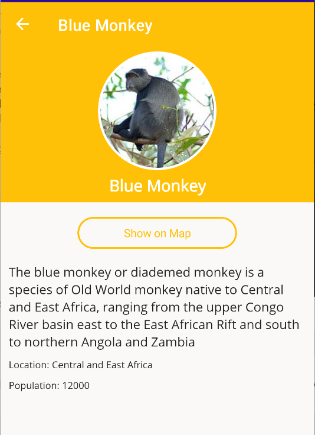

## التنقل

في الجزء 3، سنضيف تنقلًا بسيطًا لدفع صفحة جديدة إلى المكدس لعرض تفاصيل حول القرد.

تتوفر هذه الوحدة أيضًا باللغات [الانجليزية](README.md) [الصينية (المبسطة)](README.zh-cn.md) و[الصينية (التقليدية)](README.zh-tw.md).

سنستخدم التنقل المدمج في Shell في .NET MAUI. يعتمد نظام التنقل القوي هذا على URIs. يمكنك تمرير معلومات إضافية أثناء التنقل عبر معلمة الاستعلام مثل سلسلة أو كائن كامل.

على سبيل المثال، لنفترض أننا أردنا الانتقال إلى صفحة تفاصيل وتمرير معرف.

```csharp
await Shell.Current.GoToAsync("DetailsPage?name=james");
```

ثم في صفحة التفاصيل أو نموذج العرض الخاص بنا، يجب أن نحدد هذه الخاصية:

```csharp
[QueryProperty(nameof(Name), "name")]
public partial class DetailsPage : ContentPage
{
    string name;
    public string Name
    {
        get => name;
        set => name = value;
    }
}
```

عند التنقل، سيتم تمرير الاسم "james" تلقائيًا. يمكننا أيضًا تمرير كائن كامل باستخدام نفس الآلية:

```csharp
var person = new Person { Name="James" };
await Shell.Current.GoToAsync("DetailsPage", new Dictionary<string, object>
{
    { "person", person }
});
```

ثم في نموذج الصفحة أو العرض الخاص بنا، سنقوم بإنشاء الخاصية.

```csharp
[QueryProperty(nameof(Person), "person")]
public partial class DetailsPage : ContentPage
{
    Person person;
    public Person Person
    {
        get => person;
        set => person = value;
    }
}
```

هنا، يتم تسلسل وإلغاء تسلسل `Person` تلقائيًا بالنسبة لنا عندما ننتقل.

الآن، دعنا نضيف معالج النقر إلى عرض المجموعة ونمرر القرد إلى صفحة التفاصيل.

### إضافة حدث محدد

الآن، دعنا نضيف التنقل إلى صفحة ثانية تعرض تفاصيل القرد!

1. في `MonkeysViewModel.cs`، قم بإنشاء طريقة `async Task GoToDetailsAsync(Monkey monkey)` مكشوفة كـ `[RelayCommand]`:

	```csharp
    [RelayCommand]
    async Task GoToDetails(Monkey monkey)
    {
        if (monkey == null)
	    return;

        await Shell.Current.GoToAsync(nameof(DetailsPage), true, new Dictionary<string, object>
        {
            {"Monkey", monkey }
        });
    }
    ```

- يتحقق هذا الكود لمعرفة ما إذا كان العنصر المحدد غير فارغ ثم يستخدم واجهة برمجة التطبيقات المضمنة في Shell `Navigation` لدفع صفحة جديدة مع القرد كمعلمة ثم إلغاء تحديد العنصر.

1. في `MainPage.xaml` يمكننا إضافة حدث `TapGestureRecognizer` إلى `Frame` الخاص بقردنا داخل `CollectionView.ItemTemplate`:

قبل:

	```xml
    <CollectionView.ItemTemplate>
        <DataTemplate x:DataType="model:Monkey">
            <Grid Padding="10">
                <Frame HeightRequest="125" Style="{StaticResource CardView}">
                    <Grid Padding="0" ColumnDefinitions="125,*">
                        <Image
                            Aspect="AspectFill"
                            HeightRequest="125"
                            Source="{Binding Image}"
                            WidthRequest="125" />
                        <VerticalStackLayout
                            Grid.Column="1"
                            VerticalOptions="Center"
                            Padding="10">
                            <Label Style="{StaticResource LargeLabel}" Text="{Binding Name}" />
                            <Label Style="{StaticResource MediumLabel}" Text="{Binding Location}" />
                        </VerticalStackLayout>
                    </Grid>
                </Frame>
            </Grid>
        </DataTemplate>
    </CollectionView.ItemTemplate>
    ```

بعد:
	```xml
    <CollectionView.ItemTemplate>
        <DataTemplate x:DataType="model:Monkey">
            <Grid Padding="10">
                <Frame HeightRequest="125" Style="{StaticResource CardView}">
                    <!-- Add the Gesture Recognizer-->
                    <Frame.GestureRecognizers>
                        <TapGestureRecognizer 
                                Command="{Binding Source={RelativeSource AncestorType={x:Type viewmodel:MonkeysViewModel}}, Path=GoToDetailsCommand}"
                                CommandParameter="{Binding .}"/>
                    </Frame.GestureRecognizers>
                    <Grid Padding="0" ColumnDefinitions="125,*">
                        <Image
                            Aspect="AspectFill"
                            HeightRequest="125"
                            Source="{Binding Image}"
                            WidthRequest="125" />
                        <VerticalStackLayout
                            Grid.Column="1"
                            VerticalOptions="Center"
                            Padding="10">
                            <Label Style="{StaticResource LargeLabel}" Text="{Binding Name}" />
                            <Label Style="{StaticResource MediumLabel}" Text="{Binding Location}" />
                        </VerticalStackLayout>
                    </Grid>
                </Frame>
            </Grid>
        </DataTemplate>
    </CollectionView.ItemTemplate>
    ```

يستخدم هذا ارتباطًا بـ `RelativeSource`، مما يعني أنه لم يعد مرتبطًا بـ `Monkey` في `DataTemplate`، ولكنه بدلاً من ذلك يبحث في التسلسل الهرمي على وجه التحديد عن `AncestorType` من `MonkeysViewModel`. وهذا يسمح بسيناريوهات أكثر تقدمًا مثل هذا.

### ViewModel للتفاصيل

1. داخل `ViewModel/MonkeyDetailsViewModel.cs`، سنضع منطقنا لتعيين القرد لنموذج العرض. دعنا أولاً ننشئ خاصية قابلة للربط لـ `Monkey`:

	```csharp
    public partial class MonkeyDetailsViewModel : BaseViewModel
    {
        public MonkeyDetailsViewModel()
        {
        }

        [ObservableProperty]
        Monkey monkey;    
    }
    ```

1. بعد ذلك، سنضيف `QueryProperty` للتعامل مع تمرير بيانات القرد:

    ```csharp
    //Add QueryProperty
    [QueryProperty(nameof(Monkey), "Monkey")]
    public partial class MonkeyDetailsViewModel : BaseViewModel
    {
        public MonkeyDetailsViewModel()
        {
        }

        [ObservableProperty]
        Monkey monkey;
    }
    ```
    
    
## تسجيل التوجيه

الآن بعد أن أصبح لدينا صفحة التفاصيل الخاصة بنا، نحتاج إلى تسجيلها للتوجيه. يتم ذلك في كل من نظام توجيه Shell وخدمة التبعية .NET MAUI.

1. افتح الكود `AppShell.xaml.cs` وأضف الكود التالي إلى المنشئ ضمن استدعاء `InitializeComponent();`:


    ```csharp
    Routing.RegisterRoute(nameof(DetailsPage), typeof(DetailsPage));
    ```

سيؤدي هذا إلى تسجيل صفحة التفاصيل باستخدام مسار "DetailsPage"، الذي استخدمناه سابقًا.

1. افتح `MauiProgram.cs` وأضف نموذج العرض والصفحة كـ `Transient` حتى يتم إنشاء صفحة جديدة ونموذج عرض في كل مرة يتم الانتقال إليها:

    ```csharp
    builder.Services.AddTransient<MonkeyDetailsViewModel>();
    builder.Services.AddTransient<DetailsPage>();
    ```

1. أخيرًا، يجب علينا حقن نموذج العرض في صفحة "DetailsPage". افتح الكود الموجود خلف الصفحة في "DetailsPage.xaml.cs" وقم بتغيير المنشئ إلى ما يلي:

    ```csharp
	public DetailsPage(MonkeyDetailsViewModel viewModel)
	{
		InitializeComponent();
		BindingContext = viewModel;
	}
    ```

### إنشاء واجهة مستخدم DetailsPage.xaml

لنقم بإضافة واجهة مستخدم إلى DetailsPage. هدفنا النهائي هو الحصول على شاشة ملف تعريف رائعة مثل هذه:



1. لنبدأ أولاً بتحديد نوع البيانات الخاص بنا من خلال تحديد مساحة اسم نموذج العرض وتعيين العنوان أيضًا:

    ```xml
    <ContentPage
        xmlns="http://schemas.microsoft.com/dotnet/2021/maui"
        xmlns:x="http://schemas.microsoft.com/winfx/2009/xaml"
        x:Class="MonkeyFinder.DetailsPage"
        xmlns:viewmodel="clr-namespace:MonkeyFinder.ViewModel"
        x:DataType="viewmodel:MonkeyDetailsViewModel"
        Title="{Binding Monkey.Name}">

        <!-- Add Content Here -->
    </ContentPage>
    ```

1. يوجد في الأساس `ScrollView` و`Grid` لتخطيط جميع عناصر التحكم بشكل جيد على الشاشة:

    ```xml
    <ScrollView>
        <Grid RowDefinitions="Auto,Auto,*">

            <!-- Background, Image of Monkey, Name -->
        
            <!-- Details of Monkey -->

        </Grid>
    </ScrollView>
    ```

1. يمكننا الآن ملء شبكتنا بالكود التالي لوضع مربع بلون الخلفية الأصفر، ثم قص صورة القرد على شكل دائرة:

    ```xml
    <BoxView
        BackgroundColor="{StaticResource Primary}"
        Grid.RowSpan="2"
        HorizontalOptions="Fill"
        VerticalOptions="Fill"/>

    <Border StrokeShape="RoundRectangle 80"
            Stroke="White"
            StrokeThickness="6"
            HeightRequest="172"
            WidthRequest="172"
            Margin="0,8,0,0"
            HorizontalOptions="Center"
            VerticalOptions="Center">
            <Image Aspect="AspectFill"
                HeightRequest="160"
                HorizontalOptions="Center"
                VerticalOptions="Center"
                Source="{Binding Monkey.Image}"
                WidthRequest="160"/>
    </Border>

    <Label Style="{StaticResource LargeLabel}" 
            Grid.Row="1"
            TextColor="White"
            FontAttributes="Bold"
            Text="{Binding Monkey.Name}" 
            HorizontalOptions="Center"
            Margin="0,0,0,8"/>
    ```

1. أخيرًا، أسفل "التسمية"، ولكن لا يزال داخل "الشبكة"، سنضيف "VerticalStackLayout" لتوفير تفاصيل حول القرد.

```xml
<VerticalStackLayout Grid.Row="2" Padding="10" Spacing="10">
    <Label Style="{StaticResource MediumLabel}" Text="{Binding Monkey.Details}" />
    <Label Style="{StaticResource SmallLabel}" Text="{Binding Monkey.Location, StringFormat='Location: {0}'}" />
    <Label Style="{StaticResource SmallLabel}" Text="{Binding Monkey.Population, StringFormat='Population: {0}'}" />
</VerticalStackLayout>
```


1. قم بتشغيل التطبيق على المنصة المطلوبة وانقر على القرد للتنقل!

ميزات المنصة هي الموضوع التالي الذي يتعين علينا استكشافه. انتقل إلى [الجزء 4](../Part%204%20-%20Platform%20Features/README.ar-sa.md) لبدء الوحدة التالية.
