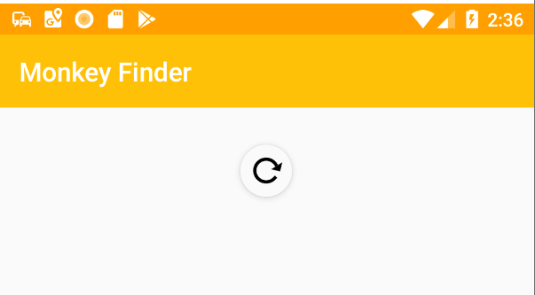

## إضافة السحب للتحديث

تتوفر هذه الوحدة أيضًا باللغات [الانجليزية](README.md) [الصينية (المبسطة)](README.zh-cn.md) و[الصينية (التقليدية)](README.zh-tw.md).

تحتوي .NET MAUI `ListView` على دعم مدمج للسحب للتحديث، إلا أن `RefreshView` يمكِّن المطورين من إضافة السحب للتحديث إلى عناصر تحكم أخرى مثل `ScrollView` و`CollectionView`.

دعنا نضيف `RefreshView` الجديد لإضافة السحب للتحديث إلى `CollectionView` الخاص بنا.

قم بتحديث منطق `CollectionView` عن طريق تغليفه بـ `RefreshView` من:

```xml
<CollectionView
    Grid.ColumnSpan="2"
    ItemsSource="{Binding Monkeys}"
    SelectionMode="None">
    <!-- Template -->
</CollectionView>
```

الي:

```xml
<RefreshView
    Grid.ColumnSpan="2"
    Command="{Binding GetMonkeysCommand}"
    IsRefreshing="{Binding IsRefreshing}">
    <ContentView>
        <CollectionView
            ItemsSource="{Binding Monkeys}"
            SelectionMode="None">
            <!-- Template -->
        </CollectionView>
    </ContentView>
</RefreshView>
```

لاحظ أننا نقلنا `Grid.ColumnSpan="2"` إلى `RefreshView` لأنه العرض الرئيسي الجديد في `Grid`.

ونظرًا لأن المستخدم يمكنه بدء التحديث، فسنرغب في إنشاء متغير جديد في الكود الخاص بنا خلفًا للربط بإيقاف التحديث عند الانتهاء.

1. افتح `MonkeysViewModel.cs` وأضف خاصية جديدة:

    ```csharp
    [ObservableProperty]
    bool isRefreshing;
    ```

1. في `finally` من `GetMonkeysAsync`، اضبط `IsRefreshing` على `false`:

    ```csharp
    finally
    {
        IsBusy = false;
        IsRefreshing = false;
    }
    ```

سيؤدي هذا إلى تمكين السحب للتحديث على أنظمة iOS وAndroid وmacOS وWindows (على شاشة اللمس):



> ملاحظة مهمة: إذا كنت تستخدم نظام iOS، فهناك حاليًا خطأ يجعل واجهة المستخدم تبدو غير صحيحة. يوصى بإزالة RefreshView عند الاختبار على نظام iOS لبقية الورشة.

## Layout

سيقوم `CollectionView` تلقائيًا بتخطيط العناصر في تخطيط مكدس رأسي. هناك العديد من `ItemsLayout` المضمنة التي يمكن استخدامها. دعنا نستكشف.

### LinearItemsLayout

هذا هو التخطيط الافتراضي الذي يمكنه عرض العناصر في اتجاهات رأسية أو أفقية. يمكنك تعيين خاصية `ItemsLayout` إلى `VerticalList` أو `HorizontalList`.

للوصول إلى خصائص إضافية في `LinearItemsLayout` سنحتاج إلى تعيين خاصية فرعية:

```xml
<CollectionView
    ItemsSource="{Binding Monkeys}"
    SelectionMode="None">
    <!-- Add ItemsLayout -->
    <CollectionView.ItemsLayout>
        <LinearItemsLayout Orientation="Vertical" />
    </CollectionView.ItemsLayout>
    <!-- ItemTemplate -->
</CollectionView>
```

### GridItemsLayout

الأمر الأكثر إثارة للاهتمام هو القدرة على استخدام `GridItemsLayout` الذي يفصل تلقائيًا بين العناصر ذات المسافات المختلفة.

دعنا نستخدم `GridItemsLayout` ونغير المسافة إلى 3

```xml
<CollectionView
    ItemsSource="{Binding Monkeys}"
    SelectionMode="None">
    <!-- Change ItemsLayout to GridItemsLayout-->
    <CollectionView.ItemsLayout>
        <GridItemsLayout Orientation="Vertical" Span="3" />
    </CollectionView.ItemsLayout>
    <!-- ItemTemplate -->
</CollectionView>
```


يمكننا تغيير "الاتجاه" إلى "أفقي" وسوف يتم الآن تمرير مجموعة "View" الخاصة بنا من اليسار إلى اليمين!

```xml
<CollectionView.ItemsLayout>
    <GridItemsLayout Orientation="Horizontal" Span="5" />
</CollectionView.ItemsLayout>
```


دعنا نعود إلى العمود الأصلي `CollectionView`:

```xml
<CollectionView.ItemsLayout>
    <LinearItemsLayout Orientation="Vertical" />
</CollectionView.ItemsLayout>
```

## EmptyView

> ملاحظة مهمة: توجد حاليًا مشكلة على Android حيث لن تختفي EmptyView. يوصى بإزالتها عند الاختبار على Android في هذا الوقت.

هناك العديد من الميزات الرائعة في `CollectionView` بما في ذلك التجميع والرأس والتذييلات والقدرة على تعيين عرض يتم عرضه عندما لا توجد عناصر.

دعنا نضيف صورة مركزية في `EmptyView`:

```xml
<CollectionView
    ItemsSource="{Binding Monkeys}"
    SelectionMode="None">
    <!-- Add EmptyView -->
    <CollectionView.EmptyView>
        <StackLayout Padding="100">
            <Image
                HorizontalOptions="Center"
                Source="nodata.png"
                HeightRequest="160"
                WidthRequest="160"
                VerticalOptions="Center" />
        </StackLayout>
    </CollectionView.EmptyView>
    <!-- ItemTemplate & ItemsLayout-->
</CollectionView>
```


في وحدتنا التالية، سنتعلم عن سمات التطبيق. انتقل إلى [الجزء 6](../Part%206%20-%20AppThemes/README.ar-sa.md)
