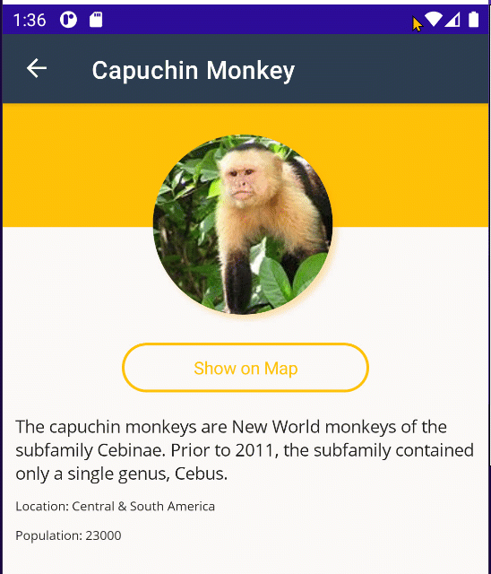

## سمات التطبيق

حتى هذه النقطة، استخدمنا سمة فاتحة قياسية في التطبيق. يحتوي .NET MAUI على مفهوم موارد التطبيق القابلة لإعادة الاستخدام والموارد التي يمكنها التكيف تلقائيًا مع سمة الجهاز.

تتوفر هذه الوحدة أيضًا باللغات [الانجليزية](README.md) [الصينية (المبسطة)](README.zh-cn.md) و[الصينية (التقليدية)](README.zh-tw.md).

## الموارد القابلة لإعادة الاستخدام

افتح ملف `App.xaml` ولاحظ وجود العديد من إدخالات `Color` و`Styles`. تم تكوينها مسبقًا لبعض الألوان والأنماط الأساسية التي استخدمناها في جميع أنحاء التطبيق. على سبيل المثال، حددنا لونًا فاتحًا للون الخلفية الرئيسي:

```xml
<Color x:Key="LightBackground">#FAF9F8</Color>
```

يمكن الرجوع إليه لاحقًا بواسطة أي عنصر واجهة مستخدم أو بواسطة نمط مشترك يمكن إعادة استخدامه. على سبيل المثال، ينطبق نمط `ButtonOutline` الخاص بنا على عنصر التحكم `Button` ويمنحه زاوية مستديرة، ويحدد الألوان للنص والحدود والخلفية:

```xml
<Style x:Key="ButtonOutline" TargetType="Button">
    <Setter Property="Background" Value="{StaticResource LightBackground}" />
    <Setter Property="TextColor" Value="{StaticResource Primary}" />
    <Setter Property="BorderColor" Value="{StaticResource Primary}" />
    <Setter Property="BorderWidth" Value="2" />
    <Setter Property="HeightRequest" Value="40" />
    <Setter Property="CornerRadius" Value="20" />
</Style>
```

هذه طريقة رائعة لمشاركة التعليمات البرمجية عبر تطبيقك بالكامل.

## تغييرات السمة - السمة الفاتحة/الداكنة

ماذا يحدث عندما تريد الرد على قيام المستخدم بتغيير جهازه لاستخدام الوضع الداكن؟ حسنًا، يحتوي .NET MAUI على مفهوم `AppThemeBinding` للقيم. دعنا نأخذ خاصية `TextColor` في `Label`. يمكننا تعريف لونين جديدين لاستخدامهما:

```xml
<Color x:Key="LabelText">Black</Color>
<Color x:Key="LabelTextDark">White</Color>
```

نريد أن يكون النص باللون الأسود عندما يكون لون الخلفية فاتحًا، وباللون الأبيض عندما يكون لون الخلفية داكنًا. عادةً، نضبط اللون على لون واحد مثل:

```xml
<Label Text="Hello, world!" TextColor="{StaticResource LabelText}"/>
```

ومع ذلك، لن يتكيف هذا مع تغييرات سمة التطبيق. يمكننا جعله `DynamicResource`، والاستماع إلى تغييرات سمة التطبيق، وتحديث قيمة `LabelText`، أو يمكننا استخدام `AppThemeBinding`:

```xml
<Label Text="Hello, world!" 
       TextColor="{AppThemeBinding Light={StaticResource LabelText}, Dark={StaticResource LabelTextDark}}"/>
```

لدينا الآن خيار إنشاء نمط قابل لإعادة الاستخدام نشير إليه بالاسم أو نمط ينطبق على كل عنصر من نوع معين:

```xml
<Style TargetType="Label" x:Key="DefaultLabel">
    <Setter Property="TextColor" Value="{AppThemeBinding Light={StaticResource LabelText}, Dark={StaticResource LabelTextDark}}" />
</Style>
```

```xml
<Label Text="Hello, world!" 
       Style="{StaticResource DefaultLabel}"/>
```

إذا تركنا `x:Key`، فسيتم تطبيقه تلقائيًا على كل `Label` في تطبيقنا.

```xml
<Style TargetType="Label">
    <Setter Property="TextColor" Value="{AppThemeBinding Light={StaticResource LabelText}, Dark={StaticResource LabelTextDark}}" />
</Style>
```

## تحديث الموارد

الآن، دعنا نضيف دعم المظهر الفاتح/الداكن في جميع أنحاء تطبيقنا.

1. دعنا نضيف بعض الألوان الجديدة التي سنستخدمها في "ResourceDictionary":

    ```xml
    <Color x:Key="CardBackground">White</Color>
    <Color x:Key="CardBackgroundDark">#1C1C1E</Color>

    <Color x:Key="LabelText">#1F1F1F</Color>
    <Color x:Key="LabelTextDark">White</Color>
    ```

1. دعنا نقوم بتحديث ألوان الخلفية على الصفحات من:

    ```xml
    <Style ApplyToDerivedTypes="True" TargetType="Page">
        <Setter Property="BackgroundColor" Value="{StaticResource LightBackground}" />
    </Style>
    ```

    الي:

    ```xml
    <Style ApplyToDerivedTypes="True" TargetType="Page">
        <Setter Property="BackgroundColor" Value="{AppThemeBinding Light={StaticResource LightBackground}, Dark={StaticResource DarkBackground}}" />
    </Style>
    ```


1. قم بتحديث قيمة `TextColor` الخاصة بـ `BaseLabel`:

    ```xml
    <Setter Property="TextColor" Value="{AppThemeBinding Light={StaticResource LabelText}, Dark={StaticResource LabelTextDark}}" />
    ```

1. أضف "الخلفية" إلى "RefreshView" الخاص بنا

    ```xml
    <Style ApplyToDerivedTypes="True" TargetType="RefreshView">
        <Setter Property="RefreshColor" Value="{StaticResource Primary}" />
        <!--Add this-->
        <Setter Property="Background" Value="{AppThemeBinding Light={StaticResource LightBackground}, Dark={StaticResource DarkBackground}}" />
    </Style>
    ```

1. تحديث "الخلفية" في "ButtonOutline"

    ```xml
    <Setter Property="Background" Value="{AppThemeBinding Light={StaticResource LightBackground}, Dark={StaticResource DarkBackground}}" />
    ```

1. تحديث "الخلفية" في "CardView"

    ```xml
    <Setter Property="Background" Value="{AppThemeBinding Light={StaticResource CardBackground}, Dark={StaticResource CardBackgroundDark}}" />
    ```

الآن، لنبدأ تشغيل التطبيق وتغيير السمة:



لقد نجحت! تهانينا! لقد قمت ببناء أول تطبيق .NET MAUI الخاص بك، وحملت البيانات من الإنترنت، ونفذت الملاحة، وأضفت ميزات المنصة، وقمت بتصميم السمة للتطبيق!
